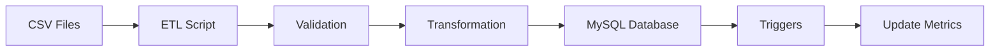
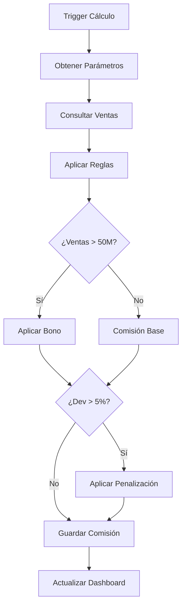

# Arquitectura del Sistema de Comisiones

## Vista General

El Sistema de Comisiones de VentasPlus S.A. está diseñado con una arquitectura modular de tres capas que garantiza escalabilidad, mantenibilidad y separación de responsabilidades.

```
┌─────────────────────────────────────────────────────────┐
│                    CAPA DE PRESENTACIÓN                  │
│                                                          │
│  ┌──────────────┐  ┌──────────────┐  ┌──────────────┐ │
│  │   Dashboard  │  │   Reportes   │  │    Admin     │ │
│  │  (HTML/JS)   │  │   (Angular)  │  │   (Angular)  │ │
│  └──────────────┘  └──────────────┘  └──────────────┘ │
└─────────────────────────────────────────────────────────┘
                            │
                            ▼
┌─────────────────────────────────────────────────────────┐
│                    CAPA DE NEGOCIO                       │
│                                                          │
│  ┌──────────────┐  ┌──────────────┐  ┌──────────────┐ │
│  │  API REST    │  │   Services   │  │  Controllers │ │
│  │    (PHP)     │  │   (Business) │  │    (MVC)     │ │
│  └──────────────┘  └──────────────┘  └──────────────┘ │
└─────────────────────────────────────────────────────────┘
                            │
                            ▼
┌─────────────────────────────────────────────────────────┐
│                     CAPA DE DATOS                        │
│                                                          │
│  ┌──────────────┐  ┌──────────────┐  ┌──────────────┐ │
│  │    MySQL     │  │     ETL      │  │    Cache     │ │
│  │   Database   │  │   Scripts    │  │   (Redis)    │ │
│  └──────────────┘  └──────────────┘  └──────────────┘ │
└─────────────────────────────────────────────────────────┘
```

## Componentes Principales

### 1. Capa de Presentación

#### Dashboard (HTML/JavaScript)
- **Tecnología**: HTML5, Bootstrap 5, Chart.js
- **Función**: Visualización de KPIs y métricas en tiempo real
- **Características**:
  - Diseño responsivo
  - Gráficos interactivos
  - Actualización en tiempo real
  - Exportación de datos

#### Módulo de Reportes (Angular)
- **Tecnología**: Angular 15, TypeScript
- **Función**: Generación y visualización de reportes detallados
- **Características**:
  - Filtros avanzados
  - Exportación múltiples formatos
  - Plantillas personalizables

#### Panel de Administración
- **Tecnología**: Angular 15
- **Función**: Gestión de parámetros y configuraciones
- **Características**:
  - CRUD de vendedores
  - Configuración de reglas
  - Gestión de usuarios

### 2. Capa de Negocio

#### API REST
- **Tecnología**: PHP 8.1
- **Framework**: Slim Framework / Custom MVC
- **Función**: Exposición de servicios
- **Endpoints principales**:
  ```
  GET    /api/comisiones
  POST   /api/comisiones/calcular
  GET    /api/vendedores
  GET    /api/dashboard/kpis
  POST   /api/ventas/importar
  ```

#### Servicios de Negocio
- **ComisionService**: Lógica de cálculo de comisiones
- **VentaService**: Procesamiento de ventas
- **ReporteService**: Generación de reportes
- **ImportService**: Importación de datos

#### Controllers MVC
- **ComisionController**: Gestión de comisiones
- **VendedorController**: Gestión de vendedores
- **DashboardController**: Datos del dashboard
- **ImportController**: Importación de archivos

### 3. Capa de Datos

#### Base de Datos MySQL
- **Versión**: MySQL 8.0
- **Características**:
  - Procedimientos almacenados
  - Triggers automáticos
  - Vistas optimizadas
  - Índices estratégicos

#### ETL Scripts
- **Tecnología**: PHP Scripts
- **Función**: Procesamiento de archivos CSV
- **Características**:
  - Validación de datos
  - Transformación automática
  - Log de errores
  - Procesamiento batch

## Flujos de Datos

### Flujo de Importación de Ventas



### Flujo de Cálculo de Comisiones



## Modelo de Datos

### Entidades Principales

#### Vendedores
```sql
vendedores (
    id: INT PK,
    codigo: VARCHAR(20),
    nombre: VARCHAR(100),
    email: VARCHAR(100),
    estado: ENUM
)
```

#### Ventas
```sql
ventas (
    id: INT PK,
    vendedor_id: INT FK,
    producto_id: INT FK,
    fecha_venta: DATE,
    valor_total: DECIMAL,
    tipo_operacion: ENUM
)
```

#### Comisiones
```sql
comisiones (
    id: INT PK,
    vendedor_id: INT FK,
    periodo: VARCHAR(7),
    ventas_netas: DECIMAL,
    comision_final: DECIMAL,
    estado: ENUM
)
```

## Seguridad

### Medidas Implementadas

1. **Autenticación y Autorización**
   - JWT Tokens para API
   - Roles y permisos
   - Sesiones seguras

2. **Protección de Datos**
   - Encriptación de datos sensibles
   - Prepared statements (SQL Injection)
   - Validación de entrada

3. **Auditoría**
   - Log de transacciones
   - Registro de cambios
   - Trazabilidad completa

## Escalabilidad

### Estrategias de Optimización

1. **Base de Datos**
   - Índices optimizados
   - Particionamiento de tablas
   - Query optimization

2. **Caché**
   - Redis para datos frecuentes
   - Caché de consultas
   - Session storage

3. **Procesamiento**
   - Colas de trabajo (Queue)
   - Procesamiento asíncrono
   - Batch processing

## Monitoreo y Mantenimiento

### Herramientas de Monitoreo

1. **Performance**
   - New Relic / DataDog
   - MySQL slow query log
   - PHP profiling

2. **Errores**
   - Sentry para tracking
   - Logs centralizados
   - Alertas automáticas

3. **Métricas de Negocio**
   - Dashboard de KPIs
   - Reportes automáticos
   - Alertas de anomalías

## Despliegue

### Ambiente de Desarrollo
```yaml
- PHP 8.1 con Composer
- MySQL 8.0 local
- Node.js 18+ para frontend
- Docker opcional
```

### Ambiente de Producción
```yaml
- Servidor: Ubuntu 22.04 LTS
- Web Server: Nginx + PHP-FPM
- Database: MySQL 8.0 (RDS)
- Cache: Redis
- CDN: CloudFlare
```

### CI/CD Pipeline
```yaml
1. Git Push → GitHub
2. GitHub Actions
3. Run Tests
4. Build Assets
5. Deploy to Staging
6. Manual Approval
7. Deploy to Production
```

## Consideraciones Técnicas

### Performance
- Consultas optimizadas con índices
- Lazy loading en frontend
- Compresión de assets
- CDN para recursos estáticos

### Mantenibilidad
- Código modular y reutilizable
- Documentación inline
- Tests unitarios y de integración
- Versionamiento semántico

### Disponibilidad
- SLA objetivo: 99.9%
- Backups automáticos diarios
- Plan de recuperación ante desastres
- Monitoreo 24/7

## Roadmap Técnico

### Fase 1 (Actual)
- ✅ Sistema base de comisiones
- ✅ Dashboard de visualización
- ✅ Importación de CSV
- ✅ Cálculo automático

### Fase 2 (Q1 2025)
- API pública documentada
- Integración con ERP
- App móvil para vendedores
- Notificaciones push

### Fase 3 (Q2 2025)
- Machine Learning para predicciones
- Análisis predictivo de ventas
- Automatización completa
- Multi-tenancy

## Contacto y Soporte

**Equipo de Desarrollo**
- Email: desarrollo@ventasplus.com
- Slack: #equipo-comisiones
- Wiki: https://wiki.ventasplus.com/comisiones

**Documentación Adicional**
- [Manual de Usuario](manual_usuario.md)
- [Guía de API](api.md)
- [Guía de Desarrollo](desarrollo.md)
- [FAQ Técnico](faq_tecnico.md)